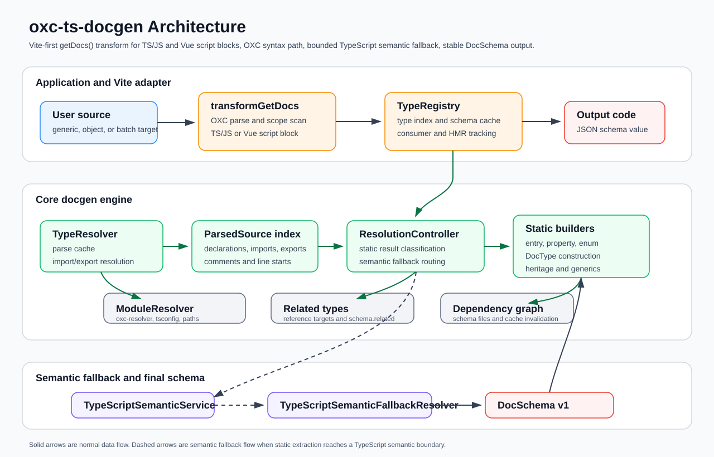
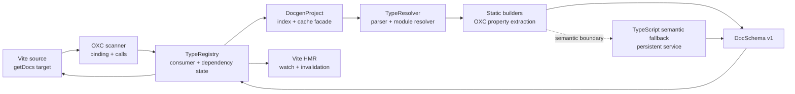

# Project Architecture

`oxc-ts-docgen` turns explicit `getDocs()` targets into stable `DocSchema`
JSON for custom documentation UIs.





## Product Boundary

`oxc-ts-docgen` documents exactly the requested TypeScript type:

```ts
const docs = getDocs<MyType>();
const docs = getDocs({ path: "./types", symbol: "MyType" });
const examples = getDocs([{ id: "my-type", path: "./types", symbol: "MyType" }] as const);
```

It is not a site generator, TypeDoc replacement, Storybook output tool, or
React component detector. User interfaces consume `DocSchema` and decide how to
render it.

## Package Responsibilities

| Path                   | Responsibility                                                                                                                                                      |
| ---------------------- | ------------------------------------------------------------------------------------------------------------------------------------------------------------------- |
| `packages/docgen`      | Core schema generation, config, parser indexes, resolver, static builders, semantic fallback, project cache, dependency records, CLI, and `getDocs()` runtime stub. |
| `packages/vite-plugin` | Vite lifecycle, call scanning, transforms, Vue SFC script support, registry, consumer graph, HMR invalidation, and virtual schema modules.                          |
| `playground`           | Development app and curated schema-rendering UI.                                                                                                                    |

Published packages support Node.js >=22.12.0. Workspace tooling requires
Node.js >=22.18.0.

## Source Layout

Core:

- `packages/docgen/src/index.ts`: public package root.
- `packages/docgen/src/cli.ts`: CLI entry.
- `packages/docgen/src/public`: API, config, debug records, presets.
- `packages/docgen/src/schema`: schema types and schema build pipeline.
- `packages/docgen/src/project`: `DocgenProject`, project type index, schema
  cache.
- `packages/docgen/src/builders`: static OXC entry/property/type builders.
- `packages/docgen/src/resolver`: parser indexes, module resolver, re-export
  traversal, heritage, generics, related entries, source references.
- `packages/docgen/src/semantic`: TypeScript language service fallback and
  semantic property/type/JSDoc/source conversion.
- `packages/docgen/src/graph`, `model`, `utils`: dependency records, normalized
  model helpers, path/JSDoc/source utilities.

Vite plugin:

- `packages/vite-plugin/src/index.ts`: public package root.
- `packages/vite-plugin/src/plugin.ts`: Vite plugin lifecycle.
- `packages/vite-plugin/src/scanner`: `getDocs()` call scanner.
- `packages/vite-plugin/src/transform`: module transform, writer, Vue SFC
  transform.
- `packages/vite-plugin/src/registry`: `TypeRegistry`, dependency collector,
  source resolver.
- `packages/vite-plugin/src/graph`, `utils`: consumer/dependency graph and path
  helpers.

Tests mirror the source domains under `packages/*/tests/{public,resolver,...}`.

## Runtime Flow

1. `docgenPlugin()` creates a `TypeRegistry` during Vite `configResolved`.
2. The registry owns a core `DocgenProject` facade.
3. `DocgenProject` scans source files with `ProjectTypeIndex`, respecting
   include/exclude pruning and `include: []` as include-all.
4. The transform only parses modules that contain `getDocs`.
5. OXC scanning finds the imported `getDocs` binding and ignores shadowed local
   bindings.
6. Generic, object, and batch targets resolve to exported TypeScript module
   symbols.
7. The registry asks core for a schema and records dependency/consumer edges.
8. The transform emits inline `JSON.parse(...)` output or a virtual schema
   module import.
9. HMR invalidates consumers and virtual modules from explicit dependency
   records.

Unresolved but recoverable dev calls are left in place with watch dependencies.
Build mode fails so incomplete schemas are not shipped.

## Hybrid Core

```txt
OXC handles syntax, indexing, transforms, source locations, cheap property extraction, and HMR inputs.
TypeScript handles property sets that require checker semantics.
Docgen normalizes both into DocSchema.
```

Static builders handle local declarations, imports, common barrels, interface
heritage, enum members, function signatures, object literals, and bounded
utility composition.

Hybrid mode routes unsupported object-like shapes to semantic fallback:

- mapped and conditional types;
- indexed access and `keyof` patterns;
- semantic-only utility helpers;
- object-like unions that need branch property merging;
- source-aware related types and in-memory generation paths.

Static mode may preserve unresolved/reference/display output for unsupported
patterns. Hybrid mode should prefer semantic fallback, reference/display output,
or diagnostics instead of silent successful empty property lists.

## Schema Contract

Normal output is JSON-compatible:

```ts
type DocSchema = {
  version: 1;
  entries: DocEntry[];
  related?: DocEntry[];
};
```

`DocEntry` represents one requested declaration. `DocProperty` represents a row
or object member. `DocType` represents structured type data when reliable and
opaque/display output when expansion would be noisy or unsafe.

Debug records are optional. They must not mutate or pollute normal `DocSchema`
output.

## Public API Boundary

The `@synthfall/oxc-ts-docgen` root exports user APIs and the `DocgenProject`
adapter facade. Resolver, parser, graph, cache, and semantic primitives remain
source-internal implementation details. Do not reintroduce hidden
`@synthfall/oxc-ts-docgen/internal` subpaths.

The Vite transform must stay syntax-only. It must not query TypeScript semantic
types directly; semantic work belongs behind core `DocgenProject` and resolver
facades.

## Release Flow

Changesets owns semantic versioning, changelogs, and npm publishing. The two
published packages are fixed together so the schema/runtime and Vite adapter
versions stay aligned.

Development changes add a changeset with `pnpm changeset`. The unified `CI`
workflow runs lint, typecheck, tests, and release artifact checks for pull
requests and non-`master` branches. Pushes to `master` open a version PR or
publish packages after the version PR is merged. `pnpm release:publish` builds,
verifies publishable artifacts, and publishes with npm provenance; it does not
repeat the code-quality pipeline.

## Maintainer Commands

Root commands:

```bash
pnpm test
pnpm typecheck
pnpm lint
pnpm format
pnpm build
pnpm release:check
pnpm changeset
pnpm release:version
pnpm release:publish
```

Package commands:

```bash
pnpm --filter @synthfall/oxc-ts-docgen run build
pnpm --filter @synthfall/oxc-ts-docgen run typecheck
pnpm --filter @synthfall/oxc-ts-docgen-vite run build
pnpm --filter @synthfall/oxc-ts-docgen-vite run typecheck
pnpm --filter playground run dev
```

## Key Tests

```bash
pnpm exec vitest run \
  packages/docgen/tests/public/api.test.ts \
  packages/docgen/tests/resolver/resolver.test.ts \
  packages/docgen/tests/contracts/architecture-contracts.test.ts \
  packages/vite-plugin/tests/transform/transform.test.ts \
  packages/vite-plugin/tests/plugin/plugin.test.ts
```

Broader release confidence:

```bash
pnpm test
pnpm typecheck
pnpm lint
pnpm build
pnpm release:check
```
